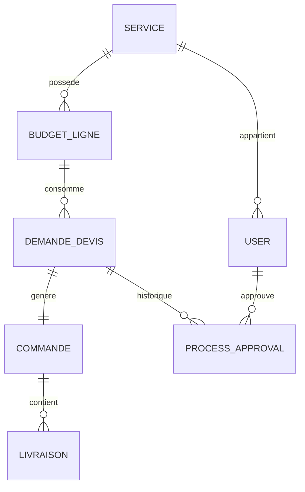

# CAHIER DES CHARGES TECHNIQUE
## APPLICATION BUDGET WORKFLOW PAVLOVA

---

**Version :** 1.0  
**Date :** 12 juillet 2025  
**Projet :** Budget Workflow Pavlova  
**Classification :** Système de Gestion Budgétaire d'Entreprise  

---

## 1. CONTEXTE ET OBJECTIFS

### 1.1 Présentation du Projet

**Budget Workflow Pavlova** est une application web de gestion budgétaire et de workflow d'approbation d'achats développée avec Laravel et Filament. L'application digitalise et automatise le processus de demandes de devis, d'approbations hiérarchiques et de suivi des commandes jusqu'à la livraison.

### 1.2 Objectifs Fonctionnels

- **Gestion centralisée des budgets** par service organisationnel
- **Workflow d'approbation en 5 niveaux** avec traçabilité complète  
- **Interface utilisateur différenciée** selon les rôles et responsabilités
- **Automatisation du processus** de la demande à la réception
- **Reporting et exports** avancés avec tableaux de bord temps réel
- **Contrôle budgétaire** avec alertes de dépassement

### 1.3 Parties Prenantes

| Rôle | Responsabilités |
|------|-----------------|
| **Administrateur** | Configuration système, gestion utilisateurs |
| **Responsable Budget** | Validation budgétaire, création lignes budgétaires |
| **Service Achat** | Négociation fournisseurs, gestion commandes |
| **Services Demandeurs** | Création demandes, validation réceptions |
| **Direction** | Validation stratégique, pilotage global |

---

## 2. ARCHITECTURE TECHNIQUE

### 2.1 Stack Technologique

#### Backend
- **Framework :** Laravel 10.x (PHP 8.1+)
- **Interface Admin :** Filament v3 (Framework d'administration Laravel)
- **Base de données :** SQLite (développement), PostgreSQL (production)
- **Cache :** Redis (production), File (développement)
- **Queue :** Redis/Database pour jobs asynchrones

#### Frontend  
- **Framework UI :** Filament (Livewire + Alpine.js + Tailwind CSS)
- **Graphiques :** Chart.js intégré dans widgets Filament
- **Animations :** CSS3 + Alpine.js pour interactions temps réel
- **Responsive :** Tailwind CSS avec breakpoints mobile/tablette/desktop

#### Authentification & Autorisation
- **Authentification :** Laravel Sanctum/Session
- **Gestion des rôles :** Spatie Laravel Permission v5
- **Policies :** Laravel Policy system pour autorisations granulaires

#### Services Tiers
- **Exports :** Maatwebsite Excel + Barryvdh DomPDF
- **Media :** Spatie Laravel Media Library (gestion fichiers)
- **Notifications :** Laravel Notification + Mail + Database

### 2.2 Architecture Applicative

```
┌─────────────────────┐
│   COUCHE PRÉSENTATION   │
│   Filament Resources    │
│   Widgets & Dashboard   │
└─────────────────────┘
           │
┌─────────────────────┐
│   COUCHE MÉTIER     │
│   Services Business │
│   Observers & Jobs  │
│   Traits Workflow   │
└─────────────────────┘
           │
┌─────────────────────┐
│   COUCHE DONNÉES    │
│   Models Eloquent   │
│   Relations & Scopes│
│   Migrations        │
└─────────────────────┘
```

---

## 3. MODÈLE DE DONNÉES

### 3.1 Entités Principales

#### Service
- **Description :** Entité organisationnelle (Direction, Service IT, RH, etc.)
- **Attributs :** nom, code, responsable, actif, budget_global
- **Relations :** HasMany BudgetLigne, HasMany User

#### BudgetLigne  
- **Description :** Ligne budgétaire allouée à un service pour une année
- **Attributs :** service_id, intitule, montant_ht_prevu, montant_ttc_prevu, date_prevue, valide_budget
- **Calculs :** montant_engage, montant_consomme, budget_restant
- **Relations :** BelongsTo Service, HasMany DemandeDevis

#### DemandeDevis
- **Description :** Demande d'achat avec workflow d'approbation
- **Attributs :** denomination, quantite, prix_unitaire_ht, prix_total_ttc, statut, current_step
- **Workflow :** pending → pending_manager → pending_direction → pending_achat → pending_delivery → delivered_confirmed
- **Relations :** BelongsTo Service, BelongsTo BudgetLigne, HasOne Commande, MorphMany ProcessApproval

#### Commande
- **Description :** Bon de commande généré après validation achat
- **Attributs :** numero_commande, date_commande, fournisseur_contact, montant_reel, statut
- **Relations :** BelongsTo DemandeDevis, HasMany Livraison

#### ProcessApproval
- **Description :** Historique des approbations/rejets
- **Attributs :** approvable_type, approvable_id, user_id, step, action, comment
- **Relations :** MorphTo approvable, BelongsTo User

### 3.2 Diagramme Relationnel



---

## 4. SPÉCIFICATIONS FONCTIONNELLES

### 4.1 Gestion des Budgets

#### F1 - Création et Validation de Lignes Budgétaires
- **Acteur :** Responsable Budget
- **Description :** Création d'enveloppes budgétaires par service avec validation
- **Critères :** Montants HT/TTC, dates d'exercice, intitulés descriptifs
- **Règles :** Une ligne = un service + une enveloppe pour période donnée

#### F2 - Calculs Budgétaires Automatiques  
- **Montant Engagé :** Somme des demandes approuvées en cours (statut ≠ delivered/rejected)
- **Montant Consommé :** Somme des demandes finalisées (statut = delivered_confirmed)
- **Budget Restant :** Montant alloué - (montant engagé + montant consommé)

### 4.2 Workflow d'Approbation

#### F3 - Processus en 5 Étapes
1. **Création (pending)** - Service demandeur
2. **Validation Manager (pending_manager)** - Manager du service  
3. **Validation Direction (pending_direction)** - Direction/responsable-budget
4. **Validation Achat (pending_achat)** - Service achat  
5. **Livraison & Réception (pending_delivery → delivered_confirmed)** - Service demandeur

#### F4 - Actions Workflow
- **Approuver :** Transition vers étape suivante avec commentaire optionnel
- **Rejeter :** Retour vers demandeur avec commentaire obligatoire  
- **Déléguer :** Transmission vers responsable suppléant (si configuré)

#### F5 - Règles Métier Workflow
- **Contrôle budgétaire :** Vérification budget disponible avant engagement
- **Permissions :** Seuls les utilisateurs autorisés peuvent approuver à chaque étape
- **Traçabilité :** Historique complet avec horodatage et justifications
- **Notifications :** Alertes automatiques à chaque transition

### 4.3 Gestion des Commandes et Livraisons

#### F6 - Génération Automatique de Commandes
- **Déclencheur :** Approbation par service achat
- **Contenu :** Numéro auto-généré, données fournisseur, montants validés
- **Suivi :** États (en_cours, livree_partiellement, livree, annulee)

#### F7 - Validation des Réceptions
- **Acteur :** Service demandeur original
- **Documents :** Upload bons de livraison obligatoires
- **Contrôles :** Vérification conformité quantité/qualité
- **Finalisation :** Validation définitive libérant l'engagement budgétaire

---

## 5. SPÉCIFICATIONS TECHNIQUES

### 5.1 Architecture des Classes

#### Modèles (Eloquent)
```php
// Traits utilisés
- Approvable : Méthodes approve(), reject(), getCurrentStep()
- SoftDeletes : Suppression logique
- HasFactory : Factories pour tests

// Relations principales  
- Service hasMany BudgetLigne, User
- BudgetLigne belongsTo Service, hasMany DemandeDevis  
- DemandeDevis belongsTo Service, BudgetLigne; hasOne Commande
- User belongsTo Service; morphMany ProcessApproval
```

#### Resources Filament
```php
- DemandeDevisResource : CRUD + workflow actions
- BudgetLigneResource : Gestion budget + exports  
- CommandeResource : Suivi commandes
- LivraisonResource : Validation réceptions
```

#### Widgets & Dashboard
```php  
- BudgetStatsWidget : Métriques budgétaires par rôle
- WorkflowTimelineWidget : Visualisation workflow en cours
- ExecutiveStatsWidget : KPI direction
- NotificationCenterWidget : Alertes temps réel
```

### 5.2 Sécurité et Permissions

#### Rôles Système
| Rôle | Code | Permissions Clés |
|------|------|------------------|
| Administrateur | `administrateur` | Toutes permissions |
| Responsable Budget | `responsable-budget` | Gestion budget globale, approbation niveau 1 |
| Service Achat | `service-achat` | Approbation niveau 2, gestion commandes |
| Service Demandeur | `service-demandeur` | CRUD demandes de son service, validation réceptions |
| Direction | `responsable-direction` | Vue globale, approbation niveau 1bis |

#### Contrôles d'Accès (Policies)
- **Service-based :** Utilisateurs limités à leur service d'affectation
- **Role-based :** Actions autorisées selon rôle + étape workflow
- **Resource-based :** Accès aux données selon propriété/responsabilité

### 5.3 Performance et Scalabilité

#### Optimisations Base de Données
```sql
-- Index critiques pour performance
CREATE INDEX idx_demande_devis_service_statut ON demande_devis(service_demandeur_id, statut);
CREATE INDEX idx_budget_lignes_service_valide ON budget_lignes(service_id, valide_budget);
CREATE INDEX idx_process_approvals_poly ON process_approvals(approvable_type, approvable_id);
```

#### Cache Strategy
- **Query Caching :** Redis pour résultats calculs budgétaires
- **Session Caching :** Redis pour sessions utilisateur  
- **View Caching :** Cache fragments widgets coûteux
- **Config Caching :** Cache Laravel pour permissions/rôles

---

## 6. INTERFACE UTILISATEUR

### 6.1 Design System

#### Frameworks UI
- **Design :** Filament v3 (Tailwind CSS + Alpine.js + Livewire)
- **Composants :** Bibliothèque Filament (forms, tables, widgets, notifications)
- **Thème :** Personnalisation couleurs primaires/secondaires
- **Iconographie :** Heroicons (Heroicon-o-*, Heroicon-s-*)

#### Responsive Design
- **Mobile :** 320px - 768px (navigation collapsée, widgets empilés)
- **Tablette :** 768px - 1024px (sidebar réduit, grilles adaptées)  
- **Desktop :** 1024px+ (interface complète, multi-colonnes)

### 6.2 Dashboards par Rôle

#### Dashboard Service Demandeur
- **Widgets :** Budget consommé service, demandes en cours, alertes
- **Actions rapides :** Nouvelle demande, consulter budget, historique
- **Limitations :** Vue restreinte au service d'affectation

#### Dashboard Direction/Budget
- **Widgets :** Métriques globales, top services consommateurs, alertes dépassements
- **Analytics :** Tendances consommation, prédictions fin d'exercice
- **Exports :** Rapports exécutifs multi-formats (Excel, PDF)

#### Dashboard Service Achat
- **Widgets :** Demandes en attente validation, commandes en cours, fournisseurs
- **Workflow :** Queue approbations, suivi livraisons, relances
- **Outils :** Gestion fournisseurs, historique négociations

### 6.3 Formulaires et Workflows

#### Wizard de Création de Demande
```php
Étape 1: Informations générales (dénomination, service, budget)
Étape 2: Détails techniques (quantité, prix unitaire, spécifications)  
Étape 3: Fournisseur et devis (contact, documents, négociation)
Étape 4: Validation et soumission (récapitulatif, budget disponible)
```

#### Actions en Lot (Bulk Actions)
- **Approbation groupée :** Sélection multiple + validation en une action
- **Export sélectif :** Génération rapports sur éléments sélectionnés
- **Notifications groupées :** Envoi communications ciblées

---

## 7. FONCTIONNALITÉS AVANCÉES

### 7.1 Système d'Exports

#### Exports Excel Multipages
- **Feuille Synthèse :** Métriques globales + graphiques automatiques
- **Feuille Détail :** Ligne par ligne avec calculs budgétaires  
- **Feuille Workflow :** Historique complet des approbations
- **Feuille Analytics :** Tendances et prédictions

#### Exports PDF Exécutifs
- **Rapports Direction :** Tableaux de bord visuels avec KPI
- **Rapports Service :** Focus consommation service spécifique
- **Rapports Audit :** Traçabilité complète pour conformité

### 7.2 Notifications et Alertes

#### Notifications Workflow
- **Temps réel :** Filament notifications pour actions immédiates
- **Email :** Notifications asynchrones pour approbations requises
- **Dashboard :** Centre de notifications avec historique

#### Alertes Budgétaires  
- **Seuils :** Alertes à 80%, 90%, 95% consommation budget
- **Dépassements :** Notifications direction pour dépassements
- **Prédictions :** Alertes préventives basées sur tendances

### 7.3 Reporting et Analytics

#### Tableaux de Bord Temps Réel
- **Widgets Auto-refresh :** Mise à jour automatique (60s)
- **Métriques Clés :** Budget consommé, demandes en cours, délais moyens
- **Graphiques Dynamiques :** Évolution consommation, répartition par service

#### Analytics Prédictives
- **Tendances :** Projection consommation fin d'exercice
- **Optimisations :** Suggestions réallocation budgétaire
- **Benchmarks :** Comparaisons performance inter-services

---

## 8. CONTRAINTES ET EXIGENCES NON FONCTIONNELLES

### 8.1 Performance

#### Temps de Réponse
- **Pages administratives :** < 2 secondes (P95)
- **Widgets dashboard :** < 1 seconde avec cache
- **Exports Excel/PDF :** < 30 secondes pour 10 000 lignes  
- **Recherches :** < 500ms avec pagination

#### Capacité
- **Utilisateurs simultanés :** 100+ sans dégradation
- **Volume données :** 100 000+ demandes par exercice
- **Fichiers :** Support uploads 64MB (devis, bons livraison)

### 8.2 Sécurité

#### Authentification
- **Sessions :** Timeout configurable (défaut 2h)
- **Mots de passe :** Politique robuste avec hachage bcrypt
- **2FA :** Support optionnel authentification deux facteurs

#### Audit et Traçabilité
- **Logs applicatifs :** Toutes actions critiques horodatées
- **Historique workflow :** Conservation permanente approbations/rejets
- **Données personnelles :** Conformité RGPD avec anonymisation

### 8.3 Disponibilité

#### Infrastructure  
- **Uptime :** 99.5% disponibilité en heures ouvrées
- **Sauvegardes :** Quotidiennes automatiques avec rétention 30j
- **Monitoring :** Alertes proactives erreurs/performance

#### Maintenance
- **Mises à jour :** Déploiements hors heures ouvrées
- **Rollback :** Procédure retour arrière < 30 minutes
- **Documentation :** Guides administrateur et utilisateur

---

## 9. ENVIRONNEMENTS ET DÉPLOIEMENT

### 9.1 Environnements

#### Développement
- **Base :** SQLite locale pour rapidité développement
- **Cache :** File system (pas Redis requis)
- **Debug :** Logs verbeux + Laravel Telescope optionnel

#### Staging/Recette  
- **Base :** PostgreSQL miroir production
- **Cache :** Redis pour tests performance réalistes
- **Données :** Jeu de données anonymisé production

#### Production
- **Base :** PostgreSQL avec réplication + sauvegardes
- **Cache :** Cluster Redis HA
- **Monitoring :** Logs centralisés + métriques temps réel

### 9.2 Prérequis Système

#### Serveur Web
```bash
# Prérequis minimaux
- PHP 8.1+ (extensions: pdo, sqlite, postgresql, redis, gd, curl, zip)
- Nginx/Apache avec HTTPS
- Composer 2.x
- Node.js 18+ (pour compilation assets)

# Base de données  
- PostgreSQL 14+ (production)
- SQLite 3.35+ (développement)
- Redis 6.0+ (cache et sessions)
```

#### Configuration PHP Recommandée
```ini
memory_limit = 512M
upload_max_filesize = 64M  
post_max_size = 64M
max_execution_time = 300
opcache.enable = 1
```

---

## 10. TESTS ET QUALITÉ

### 10.1 Stratégie de Tests

#### Tests Unitaires
- **Modèles :** Validation règles métier et calculs budgétaires
- **Services :** Logique workflow et notifications
- **Traits :** Comportements approbation/rejet

#### Tests d'Intégration  
- **API :** Endpoints authentification et autorisations
- **Workflow :** Chaîne complète demande → livraison
- **Permissions :** Contrôles d'accès par rôle

#### Tests Fonctionnels
- **Interface :** Navigation et actions utilisateur (Filament)
- **Exports :** Génération et contenu rapports Excel/PDF
- **Notifications :** Envoi et réception alertes

### 10.2 Métriques Qualité

#### Couverture de Code
- **Cible :** > 80% couverture pour code métier critique
- **Outils :** PHPUnit + XDebug pour mesure
- **CI/CD :** Intégration continue avec gates qualité

#### Standards Code
- **PSR :** Respect PSR-12 pour style code PHP
- **Laravel :** Conventions framework (Eloquent, Artisan, etc.)
- **Documentation :** PHPDoc pour classes et méthodes publiques

---

## 11. MAINTENANCE ET ÉVOLUTION

### 11.1 Maintenance Corrective

#### Monitoring Proactif
- **Logs :** Surveillance erreurs 500/404 automatisée
- **Performance :** Alertes dégradation temps réponse
- **Usage :** Métriques utilisateurs et fonctionnalités

#### Procédures Support
- **Escalade :** Support L1 (utilisateur) → L2 (technique) → L3 (développement)
- **Documentation :** Base de connaissances problèmes récurrents
- **SLA :** Temps résolution selon criticité incident

### 11.2 Évolutions Prévisibles

#### Phase 2 - Fonctionnalités Avancées
- **API REST :** Exposition données pour intégrations tierces
- **Mobile App :** Application mobile native (notifications push)
- **Intelligence Artificielle :** Prédictions budgétaires ML
- **Intégrations ERP :** Connecteurs SAP/Oracle/autres

#### Phase 3 - Optimisations
- **Microservices :** Découpage modules (budget, workflow, reporting)
- **Real-time :** WebSockets pour collaboration temps réel
- **Analytics :** Entrepôt de données + Business Intelligence

---

## 12. LIVRABLES ET JALONS

### 12.1 Livrables Techniques

#### Code Source
- **Repository Git :** Code versionné avec historique complet
- **Documentation :** README, installation, configuration  
- **Tests :** Suite complète avec fixtures et données test

#### Documentation
- **Technique :** Architecture, API, base de données
- **Fonctionnelle :** Guides utilisateur par rôle
- **Administrative :** Procédures déploiement et maintenance

### 12.2 Formation et Accompagnement

#### Formation Utilisateurs
- **Administrateurs :** Gestion système, utilisateurs, permissions
- **Utilisateurs Métier :** Workflow, exports, tableaux de bord
- **Support :** Documentation et vidéos auto-formation

#### Transfert de Compétences
- **Équipe Technique :** Architecture, déploiement, maintenance
- **Équipe Fonctionnelle :** Paramétrage, évolutions mineures
- **Documentation :** Procédures complètes et à jour

---

## 13. CONCLUSION

### 13.1 Synthèse Technique

L'application **Budget Workflow Pavlova** constitue une solution complète et moderne de gestion budgétaire avec workflow d'approbation. L'architecture Laravel + Filament offre robustesse, sécurité et évolutivité tout en maintenant une complexité technique maîtrisée.

### 13.2 Points Forts

- **Architecture éprouvée :** Laravel/Filament garantit maintenabilité
- **Sécurité renforcée :** Permissions granulaires et traçabilité complète
- **Interface moderne :** Responsive design avec UX optimisée par rôle
- **Évolutivité :** Structure modulaire permettant extensions futures

### 13.3 Recommandations

- **Mise en production :** Privilégier déploiement progressif par service
- **Formation :** Accompagnement utilisateur essentiel pour adoption
- **Monitoring :** Surveillance proactive dès mise en service
- **Évolutions :** Recueil feedback utilisateur pour roadmap future

---

**Fin du Cahier des Charges Technique**

*Ce document constitue la spécification complète de l'application Budget Workflow Pavlova basée sur l'analyse du code source existant.*