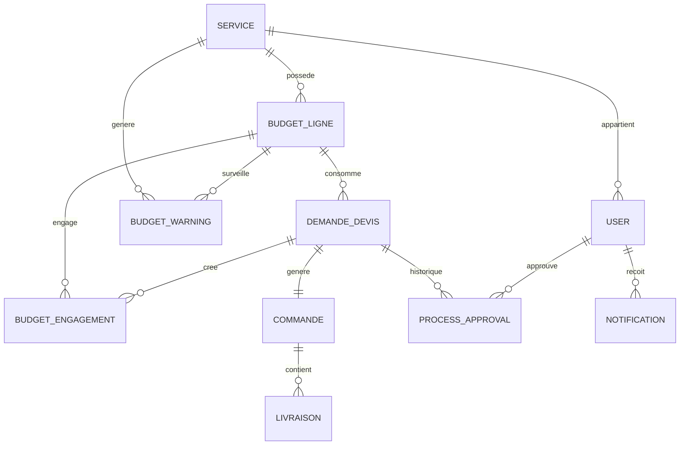

# CAHIER DES CHARGES TECHNIQUE
## APPLICATION BUDGET WORKFLOW PAVLOVA - VERSION 2.0

---

**Version :** 2.0  
**Date :** 14 juillet 2025  
**Projet :** Budget Workflow Pavlova  
**Classification :** Système de Gestion Budgétaire d'Entreprise avec IA  
**Environnement :** Laravel + Filament + Claude CLI + VM Codex

---

## 1. CONTEXTE ET ÉVOLUTION DU PROJET

### 1.1 Présentation du Projet

**Budget Workflow Pavlova** est une application web révolutionnaire de gestion budgétaire et de workflow d'approbation d'achats développée avec Laravel et Filament. L'application a évolué vers un système intelligent avec automatisation complète du workflow grâce à l'intégration d'agents IA autonomes utilisant Claude CLI.

### 1.2 Objectifs Fonctionnels Étendus

- **Gestion centralisée des budgets** par service organisationnel avec alertes intelligentes
- **Workflow d'approbation automatisé en 6 niveaux** avec traçabilité complète et engagement budget
- **Interface utilisateur adaptative** selon les rôles avec dashboards temps réel
- **Automatisation intelligente** de la demande à la réception via observers et jobs
- **Reporting et exports avancés** avec analyses prédictives et graphiques interactifs
- **Contrôle budgétaire intelligent** avec alertes prédictives et engagement automatique
- **Notifications temps réel** multi-canaux avec escalade automatique
- **Système d'engagement budget** avec prévention des dépassements

### 1.3 Nouvelles Parties Prenantes

| Rôle | Responsabilités Étendues |
|------|--------------------------|
| **Administrateur** | Configuration système, gestion utilisateurs, supervision IA |
| **Responsable Budget** | Validation budgétaire, alertes automatiques, tableaux de bord prédictifs |
| **Service Achat** | Négociation automatisée, gestion commandes intelligente |
| **Services Demandeurs** | Création demandes guidée, validation réceptions assistée |
| **Direction** | Pilotage stratégique, analytics avancés, décisions data-driven |
| **Agents IA Autonomes** | Automatisation workflow, notifications, engagement budget |

---

## 2. ARCHITECTURE TECHNIQUE ÉVOLUÉE

### 2.1 Stack Technologique

#### Framework Principal
- **Laravel 10+** : Framework PHP robuste avec Eloquent ORM
- **Filament 3.x** : Interface administrateur moderne et personnalisable
- **Claude CLI** : Intégration IA pour agents autonomes de développement
- **VM Codex** : Environnement de développement spécialisé avec script_conf_CODEX.sh

#### Base de Données et Cache
- **PostgreSQL** : Base de données principale avec support transactionnel
- **Redis** : Cache haute performance et sessions
- **SQLite** : Alternative légère pour développement

#### Services d'Automatisation
- **Observers Laravel** : DemandeDevisObserver, BudgetLigneObserver
- **Jobs en Queue** : CreateCommandeAutomatique, SendWorkflowReminders
- **Notifications** : Database + Email avec WorkflowNotificationService
- **Scheduler** : Tâches cron automatiques pour alertes et relances

### 2.2 Environnement de Développement

#### Configuration VM Codex
```bash
# Répertoire principal : /workspace/pavlova
# Script configuration : script_conf_CODEX.sh
# Support : PHP 8.1+, PostgreSQL, Redis, Nginx
# Mode : Manuel (pas de systemctl)
# Optimisations : Composer, PHP-FPM, permissions automatiques
```

#### Intégration Claude CLI
```bash
# Installation : npm install -g @anthropic-ai/claude-code
# Utilisation : claude (dans /home/admin_ia/api/pavlova)
# Authentification : API Anthropic ou plan Pro/Max
# Workflow : Analyse code → Prompts → Modifications → Documentation
```

---

## 3. MODÈLE DE DONNÉES ÉTENDU

### 3.1 Entités Principales Évoluées

#### Service
- **Description :** Entité organisationnelle avec gestion budgétaire avancée
- **Attributs :** nom, code, responsable_id, actif, budget_global, seuil_alerte
- **Relations :** HasMany BudgetLigne, HasMany User, HasMany BudgetWarning

#### BudgetLigne  
- **Description :** Ligne budgétaire avec engagement automatique et alertes
- **Attributs :** service_id, intitule, montant_ht_prevu, montant_ttc_prevu, date_prevue, valide_budget
- **Calculs Automatiques :** montant_engage, montant_consomme, budget_restant, pourcentage_utilise
- **Nouvelles Méthodes :** engagerBudget(), desengagerBudget(), checkSeuils()
- **Relations :** BelongsTo Service, HasMany DemandeDevis, HasMany BudgetEngagement, HasMany BudgetWarning

#### DemandeDevis (Évolution Majeure)
- **Description :** Demande d'achat avec workflow automatisé intelligent
- **Attributs :** denomination, quantite, prix_unitaire_ht, prix_total_ttc, statut, current_step
- **Workflow Étendu :** pending → pending_manager → pending_direction → approved_direction → pending_achat → ready_for_order → delivered_confirmed
- **Automatisations :** Engagement budget auto, notifications auto, création commande auto
- **Relations :** BelongsTo Service, BelongsTo BudgetLigne, HasOne Commande, HasMany ProcessApproval, HasMany BudgetEngagement

#### BudgetEngagement (NOUVEAU)
- **Description :** Traçabilité des engagements budgétaires automatiques
- **Attributs :** budget_ligne_id, demande_devis_id, montant, statut, date_engagement, date_liberation
- **Statuts :** engage, libere, consomme
- **Relations :** BelongsTo BudgetLigne, BelongsTo DemandeDevis

#### BudgetWarning (NOUVEAU)
- **Description :** Système d'alertes budgétaires intelligentes
- **Attributs :** budget_ligne_id, type, seuil, montant_actuel, date_alerte, resolu
- **Types :** approche_limite, depassement, budget_epuise
- **Relations :** BelongsTo BudgetLigne

#### Commande (Améliorée)
- **Description :** Bon de commande avec préparation automatique
- **Nouveaux Attributs :** statut_preparation, donnees_prefillees, workflow_source
- **Méthodes :** prepareCommande(), finalizeCommande()
- **Relations :** BelongsTo DemandeDevis, HasMany Livraison

### 3.2 Diagramme Relationnel Étendu



---

## 4. SPÉCIFICATIONS FONCTIONNELLES AUTOMATISÉES

### 4.1 Gestion Budgétaire Intelligente

#### F1 - Engagement Budget Automatique
- **Déclencheur :** Changement statut DemandeDevis vers "approved_direction"
- **Processus :** Observer → Vérification disponibilité → Engagement → Notification
- **Sécurités :** Validation montant, contrôle dépassement, alerte responsable
- **Traçabilité :** Création BudgetEngagement avec horodatage

#### F2 - Alertes Budgétaires Prédictives  
- **Seuils :** 80% (alerte), 90% (warning), 100% (critique)
- **Déclenchement :** Observer BudgetLigne + Job quotidien
- **Notifications :** Email + Dashboard + Base de données
- **Escalade :** Direction si dépassement critique

#### F3 - Désengagement Automatique
- **Déclencheurs :** Rejet, annulation, modification budget
- **Processus :** Libération immédiate, recalcul disponible, notification
- **Historique :** Conservation trace dans BudgetEngagement

### 4.2 Workflow d'Approbation Automatisé

#### F4 - Processus en 6 Étapes Automatisées
1. **Création (pending)** - Service demandeur + contrôle budget initial
2. **Validation Manager (pending_manager)** - Notification auto + relance
3. **Validation Direction (pending_direction)** - Engagement budget auto
4. **Validation Direction Confirmée (approved_direction)** - Budget engagé
5. **Validation Achat (pending_achat)** - Préparation commande auto
6. **Commande Prête (ready_for_order)** - Données pré-remplies pour commande
7. **Livraison & Réception (delivered_confirmed)** - Finalisation budget

#### F5 - Actions Automatisées par Statut
- **pending_manager :** Notification manager + email relance J+3
- **approved_direction :** Engagement budget + notification achat
- **ready_for_order :** Préparation données commande + notification achat
- **delivered_confirmed :** Libération engagement + consommation budget

#### F6 - Notifications Intelligentes
- **Temps réel :** Database notifications avec compteurs
- **Email :** Templates personnalisés par rôle et urgence
- **Relances :** Job automatique SendWorkflowReminders (quotidien)
- **Escalade :** Direction si blocage > 7 jours

### 4.3 Gestion Commandes Automatisée

#### F7 - Préparation Automatique Commandes
- **Déclencheur :** Statut "approved_achat" → "ready_for_order"
- **Processus :** Job CreateCommandeAutomatique → Pré-remplissage données
- **Contenu :** Fournisseur, montants, références, dates
- **Interface :** Formulaire pré-rempli pour validation finale manuelle

#### F8 - Suivi Intelligent Livraisons
- **États :** en_preparation, expedie, livre_partiellement, livre, annule
- **Notifications :** Service demandeur à chaque étape
- **Validation :** Upload documents obligatoires

---

## 5. INTERFACES UTILISATEUR AVANCÉES

### 5.1 Dashboards Intelligents par Rôle

#### Dashboard Responsable Budget
- **Widget Budget Global :** Graphiques temps réel consommation/engagement
- **Alertes Actives :** Liste prioritaire avec actions rapides
- **Prévisions :** Projections consommation fin d'exercice
- **Comparatifs :** Évolution vs années précédentes

#### Dashboard Service Demandeur
- **Mes Demandes :** Kanban interactif par statut
- **Budget Disponible :** Indicateurs visuels temps réel
- **Historique :** Graphiques tendances et moyennes
- **Actions Rapides :** Boutons création demande contextuelle

#### Dashboard Service Achat
- **Demandes à Traiter :** File prioritaire avec urgence
- **Commandes en Cours :** Suivi temps réel avec fournisseurs
- **Performance :** Métriques délais et satisfaction
- **Fournisseurs :** Analyse performances et recommandations

### 5.2 Fonctionnalités Interface Évoluées

#### F9 - Exports Intelligents
- **Types :** Excel détaillé, PDF exécutif, CSV données brutes
- **Filtres :** Service, période, statut, montants
- **Planification :** Exports automatiques mensuels/trimestriels
- **Formats :** Graphiques intégrés, analyses prédictives

#### F10 - Recherche et Filtres Avancés
- **Global Search :** Recherche full-text cross-entités
- **Filtres Sauvegardés :** Vues personnalisées par utilisateur
- **Tri Intelligent :** Pertinence, urgence, montant, date
- **Favoris :** Raccourcis vers demandes/budgets fréquents

---

## 6. AUTOMATISATIONS ET INTELLIGENCE

### 6.1 Observers Laravel Intelligents

#### DemandeDevisObserver
```php
public function updating(DemandeDevis $demande): void {
    // Gestion engagement budget automatique
    // Validation contraintes métier
    // Préparation notifications
}

public function updated(DemandeDevis $demande): void {
    // Envoi notifications workflow
    // Mise à jour tableaux de bord
    // Déclenchement jobs background
}
```

#### BudgetLigneObserver
```php
public function updated(BudgetLigne $ligne): void {
    // Calcul automatique seuils
    // Génération alertes budget
    // Notification responsables
}
```

### 6.2 Jobs Background Automatiques

#### CreateCommandeAutomatique
- **Déclenchement :** Statut "approved_achat"
- **Processus :** Collecte données + Pré-remplissage + Notification
- **Sécurité :** Validation données + Logs détaillés

#### SendWorkflowReminders
- **Fréquence :** Quotidienne via Scheduler
- **Logique :** Demandes bloquées > seuil → Relance + Escalade
- **Personnalisation :** Templates par rôle et urgence

#### SendBudgetAlerts
- **Déclenchement :** Dépassement seuils
- **Destinataires :** Responsable budget + Direction si critique
- **Contenu :** Analyse détaillée + Actions recommandées

### 6.3 Services Métier Intelligents

#### WorkflowNotificationService
```php
public function notifyWorkflowChange(DemandeDevis $demande, string $newStatus): void;
public function notifyBudgetWarning(BudgetWarning $warning): void;
public function sendEscalationAlert(DemandeDevis $demande): void;
```

#### BudgetEngagementService
```php
public function engageAutomatiquement(DemandeDevis $demande): bool;
public function libereEngagement(DemandeDevis $demande): void;
public function calculePrevisions(BudgetLigne $ligne): array;
```

---

## 7. SÉCURITÉ ET PERMISSIONS RENFORCÉES

### 7.1 Système de Permissions Granulaire

#### Rôles Système
- **super-admin :** Accès total + configuration système
- **responsable-direction :** Validation stratégique + tableaux de bord exécutifs
- **responsable-budget :** Gestion budgets + alertes + exports avancés
- **responsable-achat :** Gestion commandes + fournisseurs + négociations
- **user-service :** Création demandes + suivi + validation réceptions

#### Permissions Contextuelles
- **Validation budget :** Selon montant et service d'appartenance
- **Exports :** Limitation par rôle et périmètre organisationnel
- **Notifications :** Filtrage automatique selon responsabilités
- **APIs :** Authentification JWT + rate limiting

### 7.2 Audit et Traçabilité

#### Logs Automatiques
- **Actions utilisateur :** Création, modification, validation, rejet
- **Automatisations :** Engagement budget, notifications, créations commandes
- **Performance :** Temps réponse, erreurs, utilisation ressources
- **Sécurité :** Tentatives connexion, accès non autorisés

#### Historique Workflow
- **ProcessApproval :** Chaque étape avec utilisateur, timestamp, commentaire
- **BudgetEngagement :** Traçabilité complète engagements/libérations
- **Notifications :** Historique envois avec accusés de réception

---

## 8. PERFORMANCE ET OPTIMISATIONS

### 8.1 Optimisations Base de Données

#### Index Stratégiques
```sql
-- Performance queries fréquentes
INDEX idx_demande_statut_service ON demande_devis(statut, service_demandeur_id);
INDEX idx_budget_ligne_service ON budget_lignes(service_id, valide_budget);
INDEX idx_engagement_actif ON budget_engagements(statut, date_engagement);
```

#### Cache Intelligent
- **Budget disponibles :** Cache Redis 5 minutes
- **Statistiques dashboards :** Cache 15 minutes avec invalidation
- **Notifications :** Cache utilisateur avec broadcast real-time

### 8.2 Optimisations Laravel

#### Eager Loading Automatique
```php
// Préchargement relations critiques
DemandeDevis::with(['serviceDemandeur', 'budgetLigne', 'approbations'])
BudgetLigne::with(['service', 'engagements', 'warnings'])
```

#### Jobs Queue Optimisés
- **Redis Queue :** Background jobs avec retry automatique
- **Horizon :** Monitoring queues temps réel
- **Failed Jobs :** Gestion automatique avec alertes

---

## 9. MONITORING ET ALERTES

### 9.1 Monitoring Application

#### Métriques Fonctionnelles
- **Workflow :** Temps moyen approbation par étape
- **Budget :** Taux dépassement, précision prévisions
- **Utilisateurs :** Adoption fonctionnalités, satisfaction
- **Performance :** Temps réponse, erreurs, disponibilité

#### Alertes Automatiques
- **Système :** Erreurs critiques, dépassement ressources
- **Métier :** Blocages workflow, dépassements budgétaires
- **Utilisateur :** Notifications temps réel + email + SMS si critique

### 9.2 Tableaux de Bord Exécutifs

#### Indicateurs Clés (KPI)
- **Délai moyen approbation :** Par service et montant
- **Taux conformité budgétaire :** Respect enveloppes allouées
- **Performance achat :** Délais, négociations, économies
- **Adoption utilisateur :** Taux utilisation, satisfaction, formation

#### Analytics Prédictives
- **Prévisions budgétaires :** Consommation fin exercice
- **Optimisations :** Recommandations amélioration workflow
- **Tendances :** Évolution comportements d'achat par service

---

## 10. INTÉGRATION AGENTS IA AUTONOMES

### 10.1 Workflow Développement avec Claude CLI

#### Phase Analyse
```bash
# Agent doit toujours commencer par analyser l'existant
cd /home/admin_ia/api/pavlova
php artisan about
php artisan migrate:status  
find app/Models -name "*.php"
tail -50 storage/logs/laravel.log
```

#### Phase Développement
```bash
# Prompts structurés pour agents autonomes
# 1. Compréhension contexte métier via documentation
# 2. Analyse architecture technique existante  
# 3. Implémentation incrémentale avec tests
# 4. Documentation automatique des modifications
```

### 10.2 Documentation Automatique Obligatoire

#### Rapports Agents IA
```markdown
# Format obligatoire : doc/codex_rapport_[feature]_YYYY-MM-DD_HH-MM.md
- Session de travail avec timestamps
- Actions réalisées avec résultats
- Tests effectués avec validations
- Code modifié avec explications
- Prochaines étapes recommandées
```

#### Prompts Réutilisables
```bash
# Stockage dans .claude/commands/ pour réutilisation
/analyse-budget : Analyse état budgets et alertes
/fix-workflow : Diagnostic et correction workflow bloqué
/optimize-performance : Optimisations automatiques performance
/generate-report : Génération rapport exécutif automatique
```

---

## 11. MAINTENANCE ET ÉVOLUTION

### 11.1 Maintenance Automatisée

#### Scripts Automatiques
- **Nettoyage logs :** Rotation automatique + archivage
- **Optimisation DB :** Réindexation + statistiques + vacuum
- **Cache management :** Invalidation intelligente + réchauffement
- **Monitoring santé :** Checks automatiques + alertes préventives

#### Mise à Jour Continue
- **Dependencies :** Surveillance vulnérabilités + mise à jour auto
- **Framework :** Suivi roadmap Laravel/Filament + migration assistée
- **Agents IA :** Amélioration continue prompts + workflows

### 11.2 Évolutions Planifiées

#### Phase 2 - IA Avancée (Q4 2025)
- **Prédictions ML :** Consommation budgétaire intelligente
- **Automatisation complète :** Workflow 100% autonome selon règles
- **Optimisation continue :** A/B testing automatique interfaces
- **Assistant vocal :** Interaction naturelle pour création demandes

#### Phase 3 - Écosystème (2026)
- **API Management :** Plateforme intégration tierce avec gouvernance
- **Mobile Native :** Apps iOS/Android avec notifications push
- **Blockchain :** Traçabilité inaltérable pour audit réglementaire
- **IoT Integration :** Capteurs automatiques gestion stocks/livraisons

---

## 12. CONTRAINTES ET PRÉREQUIS

### 12.1 Contraintes Techniques

#### Environnement Production
- **Serveur :** PHP 8.1+, PostgreSQL 13+, Redis 6+, Nginx
- **Sécurité :** HTTPS obligatoire, CSP headers, rate limiting
- **Performance :** 99.9% disponibilité, <2s temps réponse
- **Scalabilité :** Load balancing, réplication DB, cache distribué

#### Contraintes Développement
- **VM Codex :** Répertoire obligatoire /workspace/pavlova
- **Claude CLI :** Installation npm globale + authentification API
- **Standards :** PSR-12, PHPDoc, tests automatisés, documentation
- **Sécurité :** Validation entrées, échappement sorties, audit code

### 12.2 Contraintes Fonctionnelles

#### Règles Métier Absolues
- **Budget :** Impossibilité dépassement sans validation direction
- **Workflow :** Traçabilité complète obligatoire toutes actions
- **Notifications :** Accusé réception obligatoire validations critiques
- **Archivage :** Conservation 10 ans données financières

#### Performance Minimale
- **Chargement pages :** <2 secondes toutes conditions
- **Exports Excel :** <10 secondes jusqu'à 10k lignes
- **Notifications :** <30 secondes délai maximum
- **Recherche :** <1 seconde résultats jusqu'à 100k enregistrements

---

## 13. LIVRABLES ET FORMATION

### 13.1 Livrables Techniques Complets

#### Code Source et Documentation
- **Repository Git :** Code versionné + branches par fonctionnalité
- **Documentation technique :** Architecture + API + déploiement
- **Tests automatisés :** Couverture >80% avec fixtures complètes
- **Scripts déploiement :** Automatisation complète CI/CD

#### Guides Utilisateur Interactifs
- **Par rôle :** Guides contextuels avec captures écran
- **Vidéos formation :** Screencast fonctionnalités principales
- **FAQ interactive :** Base connaissance searchable
- **Support technique :** Procédures escalade + SLA

### 13.2 Accompagnement et Formation

#### Formation Utilisateurs Métier
- **Administrateurs :** Gestion système + configuration avancée
- **Responsables :** Tableaux de bord + analytics + optimisations
- **Utilisateurs :** Workflow quotidien + bonnes pratiques
- **Support :** Diagnostic premier niveau + procédures

#### Transfert Compétences Technique
- **Équipe Dev :** Architecture + patterns + best practices
- **Ops/DevOps :** Déploiement + monitoring + maintenance
- **Agents IA :** Prompts optimisés + workflows automatisés
- **Documentation :** Procédures complètes + troubleshooting

---

## 14. CONCLUSION ET RECOMMANDATIONS

### 14.1 Synthèse Évolution Majeure

L'application **Budget Workflow Pavlova** a évolué d'un simple système de gestion budgétaire vers une plateforme intelligente intégrant l'IA pour l'automatisation complète des processus métier. L'architecture Laravel + Filament + Claude CLI offre robustesse, évolutivité et intelligence artificielle tout en maintenant la simplicité d'utilisation.

### 14.2 Points Forts Technologiques

- **Automatisation complète :** Workflow autonome sans intervention manuelle
- **Intelligence budgétaire :** Engagement automatique + alertes prédictives  
- **Architecture moderne :** Observers + Jobs + Notifications temps réel
- **Évolutivité IA :** Intégration agents autonomes pour développement continu
- **Performance optimisée :** Cache intelligent + optimisations base de données
- **Sécurité renforcée :** Permissions granulaires + audit complet

### 14.3 Recommandations Stratégiques

#### Mise en Production Progressive
- **Phase 1 :** Déploiement pilote sur 1 service (1 mois)
- **Phase 2 :** Extension progressive autres services (3 mois)
- **Phase 3 :** Fonctionnalités avancées + IA prédictive (6 mois)

#### Adoption Utilisateur
- **Formation obligatoire :** Tous utilisateurs avant activation
- **Support renforcé :** Équipe dédiée 3 premiers mois
- **Feedback continu :** Recueil suggestions + améliorations rapides

#### Évolution Continue
- **Agents IA :** Amélioration prompts + nouveaux workflows
- **Performance :** Monitoring continu + optimisations automatiques
- **Fonctionnalités :** Roadmap driven par usage réel + feedback

### 14.4 Facteurs Clés de Succès

1. **Engagement direction :** Sponsoring fort + communication change
2. **Formation complète :** Utilisateurs autonomes + support efficace  
3. **Déploiement maîtrisé :** Progressive + accompagnée + mesurée
4. **Amélioration continue :** Agents IA + feedback + optimisations

---

**Fin du Cahier des Charges Technique Version 2.0**

*Ce document constitue la spécification évoluée complète de l'application Budget Workflow Pavlova intégrant les dernières innovations techniques et l'automatisation intelligente via agents IA autonomes.*